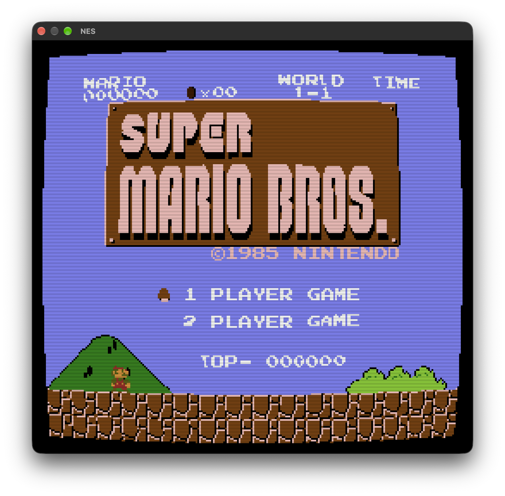

## Rust-NES-Emu



New here? Start with the [Getting Started guide](docs/GETTING_STARTED.md) for build instructions, controls, and troubleshooting.

## Features

- **Turbo buttons:** Toggle built-in turbo with **Left Shift** or the gamepad's
  **left trigger**. Hold A or B to send rapid repeated presses; toggle it again
  to return to normal input.
- **ROM browser:** Start without a ROM to open an animated TV-static screen and
  choose a `.nes` file found in the current directory or recursively under
  `roms/`.
- **Gamepad and keyboard controls:** Play with the keyboard or a USB gamepad.
  Return to the ROM menu and rescan for games without restarting the emulator.
- **Video and audio recording:** Record gameplay to MP4 with game audio using
  **0** or the gamepad's **right trigger**. FFmpeg with `libx264` support is
  required to finalize recordings.
- **Visual effects:** Configure post-processing from the command line, including
  NTSC signal simulation, CRT phosphor and scanlines, curvature, bloom,
  persistence, vignette, color correction, and LUT presets. The gamepad's **X**
  button toggles the CRT effect during play; **Y** cycles color correction and
  LUT presets.
- **Battery saves:** Load and save battery-backed PRG RAM in a `.sav` file beside
  the ROM.
- **Mapper support:** Supports the cartridge mappers listed below, including
  MMC3 and MMC5 features.

## Compatibility (Mapper)

Games which have mappers as:

- Mapper 0 (NROM)
- Mapper 1 (MMC1)
- Mapper 2 (UxROM)
- Mapper 3 (CNROM)
- Mapper 4 (MMC3)
- Mapper 5 (MMC5) - PRG/CHR banking, ExRAM and fill nametables, extended attributes,
  vertical split, scanline IRQs, multiplier, PRG RAM protection, and expansion audio
  (scanline features follow the emulator's scanline-level PPU timing)
- Mapper 7 [partial] (AxROM)
- Mapper 9 (MMC2)
- Mapper 66 (GxROM)

Directory: https://nesdir.github.io/

### Quick Start

`cargo run --release -- path/to/game.nes`

Start without a ROM to show animated TV static and a ROM picker:

`cargo run --release`

The idle screen lists `.nes` files in the current folder and searches `roms/` recursively. Use **Up/Down** or the controller **D-pad/left stick** to choose a game; press **Enter** or controller **A/Start** to launch it. While playing, press **0** or the controller's **right trigger** to start or stop an MP4 recording with game audio; recordings are saved in the command's current directory at 1152×1080, preserving the game's near-square shape. Press **Left Shift** or the controller's **left trigger** to toggle turbo for held A/B buttons. Press **Y** to enable color correction and cycle through the available LUT presets; each press selects the next preset. Press controller **X** to toggle the CRT phosphor, scanline, and edge-shading effect. The image is enlarged with nearest-neighbor sampling. Video uses standard H.264 MP4 encoding for wider player compatibility, and audio uses ALAC. FFmpeg with `libx264` support must be installed and available on `PATH` to finalize the MP4. A red border appears around the game window while recording and is not included in the recording. Press **O** to rescan, or **R** while playing to return to the menu. **Esc** quits.

### Battery Saves

For ROMs marked as battery-backed in the iNES header, the emulator loads PRG RAM from a `.sav` file beside the ROM (for example, `game.nes` uses `game.sav`). RAM is saved when you quit, return to the ROM menu, or load another game. ROMs without the battery flag do not use save files.

### Build Release

1) `cargo build --release`
2) `./target/release/runes roms/{game}.nes`

SDL2 is built from source and linked statically through the Rust SDL2 bindings. Building requires a C compiler and CMake; no separate SDL2 installation is needed.

## Project Structure

```
.
├── docs/
│   └── GETTING_STARTED.md
├── extras/
├── roms/                  # Local/sample ROMs; user ROMs are not required
├── src/
│   ├── main.rs            # Application entry point and command-line setup
│   ├── nes.rs             # Top-level emulator coordination
│   ├── bus.rs             # CPU memory and device bus
│   ├── audio.rs
│   ├── recorder.rs        # Audio/video recording
│   ├── video.rs           # Window and frame presentation
│   ├── apu/               # Audio processing unit channels and timing
│   ├── cartridge/         # ROM loading and mapper implementations
│   ├── cpu/               # CPU core, instructions, and addressing
│   ├── input/             # Keyboard, controller, and input mapping
│   ├── ppu/               # Picture processing and rendering
│   └── postprocess/       # Display effects and image processing
├── tests/                 # Integration tests grouped by subsystem
├── Cargo.toml
└── README.md
```

## Post Processing Effect Switches

1. --ntsc
2. --persistence
3. --bloom
4. --color-correction
5. --lut
6. --curvature
7. --auto-gradient
8. --scanlines
9. --vignette
10. --crt

Effects accept configurable values using either `--option value` or
`--option=value`. For example, `--bloom --bloom-strength 0.4` adjusts bloom
intensity, while `--lut cool-crt --lut-strength 0.8` selects and blends a LUT.
Available LUT presets are `identity`, `warm-crt`, `cool-crt`, `composite`,
`gameboy`, `amber`, and `high-contrast`.

Other parameters include `--bloom-threshold`, `--bloom-radius`,
`--ntsc-strength`, `--ntsc-bleed`, `--persistence-amount`,
`--persistence-frames`, `--color-brightness`, `--color-contrast`,
`--color-saturation`, `--color-gamma`, `--curvature-strength`,
`--auto-gradient-strength`, `--auto-gradient-vertical`,
`--auto-gradient-horizontal`, `--scanlines-strength`, `--vignette-strength`,
and `--crt-strength`.

## Input Devies

1. Keyboard
2. Gamepad Controller (Logitech)

## Useful Links

https://www.nesdev.org/wiki/Nesdev_Wiki
